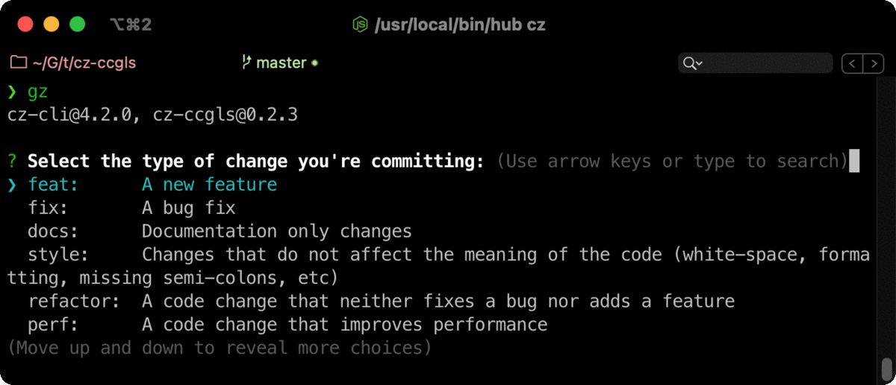

# cz-ccgls

> Adapter for [commitizen](https://github.com/commitizen/cz-cli), a prompt for [conventional changelog](https://github.com/conventional-changelog/conventional-changelog) standard.<br>
> Support [gitmoji](https://gitmoji.carloscuesta.me/) and [Lerna](https://lernajs.io/) scopes.

[](https://www.npmjs.org/package/cz-ccgls)
[](http://commitizen.github.io/cz-cli/)
[](https://conventionalcommits.org)
[](https://github.com/thierrymichel/cz-ccgls/blob/master/UNLICENSE)

Inspired by [cz-conventional-changelog](https://www.npmjs.com/package/cz-conventional-changelog) and [cz-emoji](https://github.com/ngryman/cz-emoji)



## Usage

### [Making your repo Commitizen-friendly](https://github.com/commitizen/cz-cli#making-your-repo-commitizen-friendly)

First, install the Commitizen cli tools:

```sh
npm install commitizen -g
```

Next, initialize your project to use the cz-ccgls adapter by typing:

```sh
commitizen init cz-ccgls --yarn --dev --exact
```

> Or if you are using Npm: `commitizen init cz-ccgls --save-dev --save-exact`

### Locally

```sh
# Install commitizen + adapter
yarn add -D commitizen cz-ccgls
```

Add some `config` information to your `package.json`

```json
"config": {
  "commitizen": {
    "path": "./node_modules/cz-ccgls"
  }
}
```

> [More infos in the `commitizen` documentation](https://github.com/commitizen/cz-cli#optional-install-and-run-commitizen-locally)

---

### Related

- [commitlint-config-ccgls](https://github.com/thierrymichel/commitlint-config-ccgls), the [`Commitlint`](https://github.com/marionebl/commitlint) companion.
